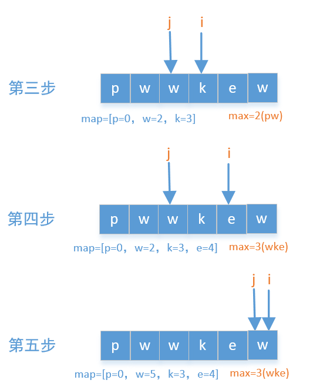

# 无重复字符的最长子串
题目描述：给定一个字符串，请你找出其中不含有重复字符的**最长子串**的长度。

#### 示例1：
- 输入：“abcabcbb”
- 输出：3
- 解释：因为无重复字符的最长子串是**abc**，所以其长度为 3。

### 示例2：
- 输入：“bbbbb”
- 输出：1
- 解释：因为无重复字符的最长子串是**b**,所以其长度为1。

### 示例3：
- 输入：“pwwkew”
- 输出:3
- 解释：因为无重复字符的最长子串是“wke”，所以其长度为3。

## 思路解析：

### 解法1(此解法收集自力扣题解)：
我们使用两个指针，一个i一个j，最开始的时候i和j指向第一个元素，然后i往后移，
把扫描过的元素都放到map中，如果i扫描过的元素没有重复的就一直往后移，顺便记录
一下最大值max，如果i扫描过的元素有重复的，就改变j的位置，我们就以pwwkew为例
画一个图看一下     


代码如下
```
    public int lengthOfLongestSubstring(String s) {
        if (s.length() == 0)
            return 0;
        HashMap<Character, Integer> map = new HashMap<>();
        int max = 0;
        for (int i = 0, j = 0; i < s.length(); ++i) {
            if (map.containsKey(s.charAt(i))) {
                j = Math.max(j, map.get(s.charAt(i)) + 1);
            }
            map.put(s.charAt(i), i);
            max = Math.max(max, i - j + 1);
        }
        return max;
    }

作者：sdwwld
链接：https://leetcode-cn.com/problems/longest-substring-without-repeating-characters/solution/javade-6chong-jie-fa-by-sdwwld/
来源：力扣（LeetCode）
```
### 解法2（此解法收集自力扣评论@南星@小肚子软绵绵）[窗口滑动]
我们先创建一个数组last，利用数组下标记录字符位置，使用start，记录窗口起始位，
使用res，记录窗口长度。首先初始化窗口起始位和敞口大小为0，接下来开始循环扩大窗
口大小，如果出现重复字符，则移动窗口起始位置，如果不重复的字符长度大于当前窗口大
小，则扩大窗口大小，直到整个字符串循环结束，返回窗口大小res。

我们就以pwwkew为例画一个图看一下


```
    public static int getSubstring(String str){
        if(s.length() == 0)
            return 0;
        int []last = new int[Character.MAX_CODE_POINT];//创建字符最大值数组，存储ascii地址
        int start = 0;//窗口开始位
        int res = 0;//窗口长度
        int n = str.length();
        for (int i=0;i<n;i++){
            int index = str.charAt(i);
            start = Math.max(start,last[index]);
            res = Math.max(res,i-start+1);
            last[index] = i+1;
        }
        return res;
    }
```