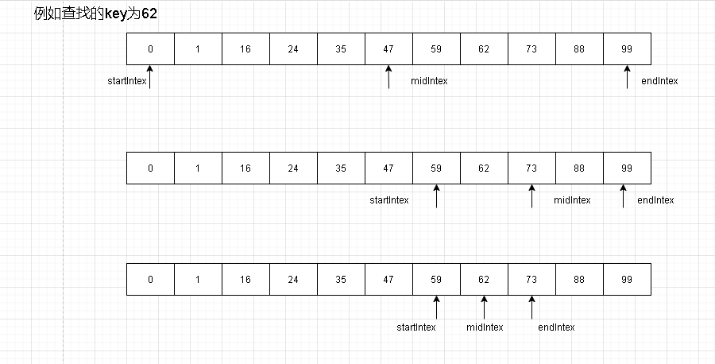

### 二分查找

概念：二分查找又称折半查找。它的前提是线性表中的记录必须是关键码有序的（通常从小到大），线性表必须采用顺序储存。二分查找的基本思想是：在有序表中，取中间记录作为比较对象，若给定值与中间记录的关键字相等，则查询成功；若给定值小于中间记录的关键字，则在中间记录的左半区继续查找；若给定值大于中间记录的关键字，则在中间记录的右半区继续查找。不断重复上述过程，直到查找成功，或所有查找区域无记录显示，查找失败为止。


#### 参考代码

```java
	/**
     * 二分查找,查询出数组中哪个下标元素为输入的key值，若key值不存在则返回-1
     * @param key 输入的需要查询的值
     * @param arr 输入的查询数组
     * @return
     */
	public static int search(int key, int[] arr){
        if(arr == null){
            return  -1;
        }

        //传进来的数组必须是有序的，这里排序算法就不去展示，而是引用java的公共实现方法
        Arrays.sort(arr);

        int startIndex = 0;
        int endIndex = arr.length-1;

        //被查找的键要么不存在，要么存在于arr数组之中
        while(startIndex <= endIndex){
            //向下取整不排除偶数情况
            int midIndex = (int) (startIndex + Math.floor((endIndex - startIndex)/2));
            if(key < arr[midIndex]){
                endIndex = midIndex - 1;
            }else if(key > arr[midIndex]){
                startIndex = midIndex + 1;
            }else{
                return midIndex;
            }
        }
        return -1;
    }
```




#### 时间复杂度

O(logn)