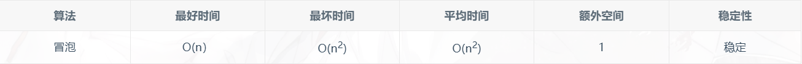

# 冒泡排序及优化详解
##算法思想
   冒泡排序属于一种典型的交换排序。
   
   交换排序顾名思义就是通过元素的两两比较，判断是否符合要求，如过不符合就交换位置来达到排序的目的。冒泡排序名字的由来就是因
为在交换过程中，类似水冒泡，小（大）的元素经过不断的交换由水底慢慢的浮到水的顶端。

   冒泡排序的思想就是利用的比较交换，利用循环将第 i 小或者大的元素归位，归位操作利用的是对 n 个元素中相邻的两个进行比较，
如果顺序正确就不交换，如果顺序错误就进行位置的交换。通过重复的循环访问数组，直到没有可以交换的元素，那么整个排序就已经完成了。


###示例
　　我们通过一个示例来理解一下基本的冒泡排序，假设当前我们有一个数组 a，内部元素为 3，4，1，5，2，即初始状态，如下图所示。
我们的目的就是通过 n 趟比较来实现有底向上从大到小的的顺序。


#### 第一遍排序
　　我们首先进行第一遍排序，如下图所示，红色代表当前比较的元素，绿色代表已经归位的元素。

　　（1）比较第一个和第二个元素，4>3，交换。

　　（2）比较第二个和第三个元素，1<3，不交换。

　　（3）比较第三个和第四个元素，5>1，交换。

　　（4）比较第四个和第五个元素，2>1，交换。

　　最后，我们可以看到 1 已经位于最顶部。第一遍需要尽心四次比较才能把五个数比较完。


#### 第二遍排序
　　第二遍排序的初始状态是第一遍排序的最终状态，即4，3，5，2，1。

　　（1）比较第一个和第二个元素，3<4，不交换。

　　（2）比较第二个和第三个元素，5>3，交换。

　　（3）比较第三个和第四个元素，2<3，不交换。

　　第二遍排序，会让 2 归位，并且这一遍只用进行三次比较就可以了。


#### 第三遍排序
　　第三遍排序的初始状态是第二遍排序的最终状态，即4，5，3，2，1。

　　（1）比较第一个和第二个元素，5>4，交换。

　　（2）比较第二个和第三个元素，3<4，不交换。

　　第三遍排序，会让 3 归位，并且这一遍只用进行两次比较就可以了。

　　然而我们可以看到这一次五个数已经全部完成了归位，但是当我们采用普通的冒泡排序的时候，算法仍然会继续向下进行。


#### 第四遍循环
　　第四遍排序的初始状态是第三遍排序的最终状态，即5，4，3，2，1。

　　这个时候就可以看出，排序实际上在第三遍已经完成了，但是算法还是会继续向下进行，下面就进行代码实现，看一下究竟是什么情况。


#### 冒泡排序性能



    关于稳定性：因为在比较的过程中，当两个相同大小的元素相邻，只比较大或者小，所以相等的时候是不会交换位置的。而当两个相等元素离着比较远的时候，也只是会把他们交换到相邻的位置。他们的位置前后关系不会发生任何变化，所以算法是稳定的。

关于最优时间复杂度为什么是O(n)，当然是优化过算法之后了！大家继续向下看就知道了！。

### 冒泡排序常规版-代码实现

下面详细分析一下常规版的冒泡排序，整个算法流程其实就是上面实例所分析的过程。可以看出，我们在进行每一次大循环的时候，还要进行一个小循环来遍历相邻元素并交换。所以我们的代码中首先要有两层循环。

　　外层循环：即主循环，需要辅助我们找到当前第 i 小的元素来让它归位。所以我们会一直遍历 n-2 次，这样可以保证前 n-1 个元素都在正确的位置上，那么最后一个也可以落在正确的位置上了。

　　内层循环：即副循环，需要辅助我们进行相邻元素之间的比较和换位，把大的或者小的浮到水面上。所以我们会一直遍历 n-1-i 次这样可以保证没有归位的尽量归位，而归位的就不用再比较了。

　　而上面的问题，出现的原因也来源于这两次无脑的循环，正是因为循环不顾一切的向下执行，所以会导致在一些特殊情况下得多余。例如 5，4，3，1，2 的情况下，常规版会进行四次循环，但实际上第一次就已经完成排序了。
### 代码示例
```$xslt
/**
 * 冒泡排序常规版
 */
public class BubbleSortNormal {
    public static void main(String[] args) {
                 int[] list = {3,4,1,5,2};
                 int temp = 0; // 开辟一个临时空间, 存放交换的中间值
                 // 要遍历的次数
                 for (int i = 0; i < list.length-1; i++) {
                         System.out.format("第 %d 遍：\n", i+1);
                         //依次的比较相邻两个数的大小，遍历一次后，把数组中第i小的数放在第i个位置上
                         for (int j = 0; j < list.length-1-i; j++) {
                                 // 比较相邻的元素，如果前面的数小于后面的数，就交换
                                 if (list[j] < list[j+1]) {
                                         temp = list[j+1];
                                         list[j+1] = list[j];
                                         list[j] = temp;
                                     }
                                 System.out.format("第 %d 遍的第%d 次交换：", i+1,j+1);
                                 for(int count:list) {
                                         System.out.print(count);
                                     }
                                 System.out.println("");
                             }
                         System.out.format("第 %d 遍最终结果：", i+1);
                         for(int count:list) {
                                 System.out.print(count);
                             }
                         System.out.println("\n#########################");
                     }
             }
}
```

### 运行结果


### 算法的第一次优化
　　经过了上述的讨论和编码，常规的冒泡排序已经被我们实现了。那么接下来我们要讨论的就是刚刚分析时候提出的问题。

　　首先针对第一个问题，当我们进行完第三遍的时候，实际上整个排序都已经完成了，但是常规版还是会继续排序。

　　可能在上面这个示例下，可能看不出来效果，但是当数组是，5，4，3，1，2 的时候的时候就非常明显了，实际上在第一次循环的时候整个数组就已经完成排序，但是常规版的算法仍然会继续后面的流程，这就是多余的了。


为了解决这个问题，我们可以设置一个标志位，用来表示当前第 i 趟是否有交换，如果有则要进行 i+1 趟，如果没有，则说明当前数组已经完成排序。实现代码如下：
### 代码示例
```$xslt
/**
 * 冒泡排序的第一次优化
 */
public class BubbleSortFirstOptimization {
    public static void main(String[] args) {
                 int[] list = {5,4,3,1,2};
                 int temp = 0; // 开辟一个临时空间, 存放交换的中间值
                 // 要遍历的次数
                 for (int i = 0; i < list.length-1; i++) {
                         int flag = 1; //设置一个标志位
                         //依次的比较相邻两个数的大小，遍历一次后，把数组中第i小的数放在第i个位置上
                         for (int j = 0; j < list.length-1-i; j++) {
                                 // 比较相邻的元素，如果前面的数小于后面的数，交换
                                 if (list[j] < list[j+1]) {
                                         temp = list[j+1];
                                         list[j+1] = list[j];
                                         list[j] = temp;
                                         flag = 0;  //发生交换，标志位置0
                                     }
                             }
                         System.out.format("第 %d 遍最终结果：", i+1);
                         for(int count:list) {
                                 System.out.print(count);
                             }
                         System.out.println("");
                         if (flag == 1) {//如果没有交换过元素，则已经有序
                                 return;
                             }

                     }
             }
}

```

　运行结果：可以看到优化效果非常明显，比正常情况下少了两次的循环。


  这个时候我们就来讨论一下上面留下的一个小地方！没错就是最优时间复杂度为O(n)的问题，我们在进行了这一次算法优化之后，就可以做到了。

　当给我们一个数列，5，4，3，2，1，让我们从大到小排序。没错，这是已经排好序的啊，也就是说因为标志位的存在，上面的循环只会进行一遍，flag没有变成1，整个算法就结束了，这也就是 O(n) 的来历了！

### 算法的第二次优化
　　　除了上面这个问题，在冒泡排序中还有一个问题存在，就是第 i 趟排的第 i 小或者大的元素已经在第 i 位上了，甚至可能第 i-1 位也已经归位了，那么在内层循环的时候，有这种情况出现就会导致多余的比较出现。例如：6，4，7，5，1，3，2，当我们进行第一次排序的时候，结果为6，7，5，4，3，2，1，实际上后面有很多次交换比较都是多余的，因为没有产生交换操作。

　　我们用刚刚优化过一次的算法，跑一下这个数组。
### 代码示例
```$xslt
/**
 * 冒泡排序的第一次优化
 */
public class BubbleSortFirstOptimization {
    public static void main(String[] args) {
                 int[] list = {5,4,3,1,2};
                 int temp = 0; // 开辟一个临时空间, 存放交换的中间值
                 // 要遍历的次数
                 for (int i = 0; i < list.length-1; i++) {
                         int flag = 1; //设置一个标志位
                         //依次的比较相邻两个数的大小，遍历一次后，把数组中第i小的数放在第i个位置上
                         for (int j = 0; j < list.length-1-i; j++) {
                                 // 比较相邻的元素，如果前面的数小于后面的数，交换
                                 if (list[j] < list[j+1]) {
                                         temp = list[j+1];
                                         list[j+1] = list[j];
                                         list[j] = temp;
                                         flag = 0;  //发生交换，标志位置0
                                     }
                             }
                         System.out.format("第 %d 遍最终结果：", i+1);
                         for(int count:list) {
                                 System.out.print(count);
                             }
                         System.out.println("");
                         if (flag == 1) {//如果没有交换过元素，则已经有序
                                 return;
                             }

                     }
             }
}


```
运行结果：可以看出，第三趟的多次比较实际上可以没有，因为中间几个位置在第二趟就没有过交换。


针对上述的问题，我们可以想到，利用一个标志位，记录一下当前第 i 趟所交换的最后一个位置的下标，在进行第 i+1 趟的时候，只需要内循环到这个下标的位置就可以了，因为后面位置上的元素在上一趟中没有换位，这一次也不可能会换位置了。基于这个原因，我们可以进一步优化我们的代码。

### 代码示例
```$xslt
/**
 * 冒泡排序第二次优化
 */
public class BubbleSortSecondOptimization {
    public static void main(String[] args) {
         int[] list = {6, 4, 7, 5, 1, 3, 2};
         int len = list.length - 1;
         int temp = 0; // 开辟一个临时空间, 存放交换的中间值
         int tempPostion = 0;  // 记录最后一次交换的位置
                 // 要遍历的次数
         for (int i = 0; i < list.length - 1; i++) {
             int flag = 1; //设置一个标志位
                         //依次的比较相邻两个数的大小，遍历一次后，把数组中第i小的数放在第i个位置上
             for (int j = 0; j < len; j++) {
                                 // 比较相邻的元素，如果前面的数小于后面的数，交换
                 if (list[j] < list[j + 1]) {
                     temp = list[j + 1];
                     list[j + 1] = list[j];
                     list[j] = temp;
                     flag = 0;  //发生交换，标志位置0
                     tempPostion = j;  //记录交换的位置

                }
                 System.out.format("第 %d 遍第%d 趟结果：", i + 1, j + 1);
                 for (int count : list) {
                     System.out.print(count);

                }
                 System.out.println("");

            }
             len = tempPostion; //把最后一次交换的位置给len，来缩减内循环的次数
             System.out.format("第 %d 遍最终结果：", i + 1);
             for (int count : list) {
                 System.out.print(count);

            }
             System.out.println("");
             if (flag == 1) {//如果没有交换过元素，则已经有序
                 return;

            }


        }

    }
}

```

　运行结果：

　　可以清楚的看到，部分内循环多余的比较已经被去掉了，算法得到了进一步的优化


