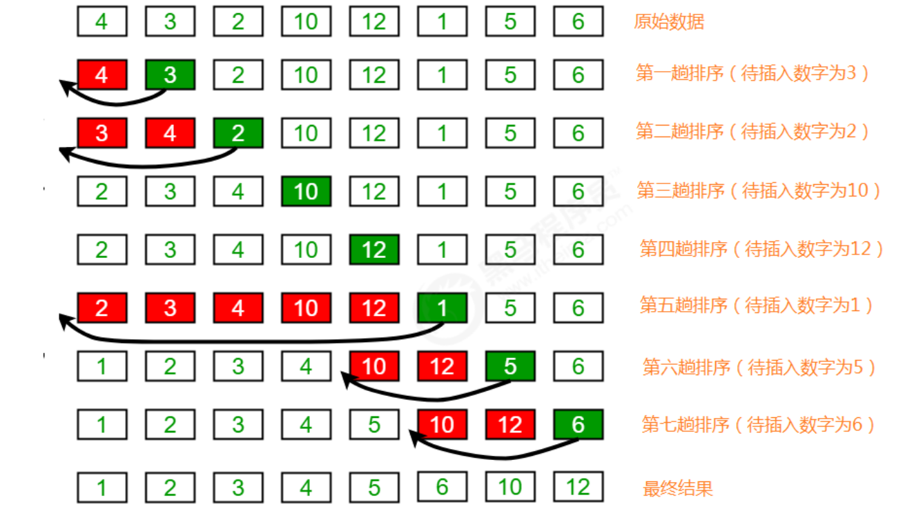
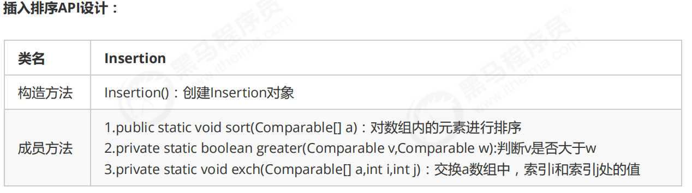

# 插入排序
插入排序（Insertion sort）是一种简单直观且稳定的排序算法。
插入排序的工作方式非常像人们排序一手扑克牌一样。开始时，我们的左手为空并且桌子上的牌面朝下。然后，我
们每次从桌子上拿走一张牌并将它插入左手中正确的位置。为了找到一张牌的正确位置，我们从右到左将它与已在
手中的每张牌进行比较。


##需求：
#####排序前：{4,3,2,10,12,1,5,6}
#####排序后：{1,2,3,4,5,6,10,12}
#####排序原理：
1.把所有的元素分为两组，已经排序的和未排序的；
2.找到未排序的组中的第一个元素，向已经排序的组中进行插入；
3.倒叙遍历已经排序的元素，依次和待插入的元素进行比较，直到找到一个元素小于等于待插入元素，那么就把待
插入元素放到这个位置，其他的元素向后移动一位；



#####插入排序API设计：


#####插入代码实现

```
package sort;

public class Insertion {
    /*
    对数组a中的元素进行排序
     */
    public static void sort(Comparable[]a){
        for (int i=1;i<a.length;i++){

            for (int j=i;j>0;j--){
                //比较索引j处的值和索引j-1处的值，如果j-1处的值比索引j处的值，则交换数据，如果大，就找到核实的位置，退出循环即可；
                //当前元素为a[i],依次和i前面的元素比较，找到一个小于等于a[i]的元素
                if (greater(a[j-1],a[j])){
                    //交换元素
                    exch(a,j-1,j);
                }else {
                    //找到了该元素，结束
                    break;
                }
            }
        }

    }

    /**
     * 比较v元素是否大于w元素
     */
    public static boolean greater(Comparable v,Comparable w){
        return v.compareTo(w)>0;
    }


    /**
     * 数组元i和j交换位置
     */
    public static  void exch(Comparable[] a,int i,int j){
        Comparable temp;
        temp = a[i];
        a[i] = a[j];
        a[j] = temp;
    }
}

```
#####测试代码：
```
package test;

        import sort.Insertion;

        import java.util.Arrays;

public class InsertionTest {
    public static void main(String[] args) {
        Integer[] a = {4,3,2,10,12,1,5,6};
        Insertion.sort(a);
        System.out.println(Arrays.toString(a));//[1, 2, 3, 4, 5, 6, 10, 12]
    }
}

```

#####插入排序的时间复杂度分析
插入排序使用了双层for循环，其中内层循环的循环体是真正完成排序的代码，所以，我们分析插入排序的时间复
杂度，主要分析一下内层循环体的执行次数即可。
最坏情况，也就是待排序的数组元素为{12,10,6,5,4,3,2,1}，那么：
######比较的次数为：
######(N-1)+(N-2)+(N-3)+...+2+1=((N-1)+1)*(N-1)/2=N^2/2-N/2;
######交换的次数为：
######(N-1)+(N-2)+(N-3)+...+2+1=((N-1)+1)*(N-1)/2=N^2/2-N/2;
######总执行次数为：
######(N^2/2-N/2)+(N^2/2-N/2)=N^2-N;
按照大O推导法则，保留函数中的最高阶项那么最终插入排序的时间复杂度为O(N^2).
    
