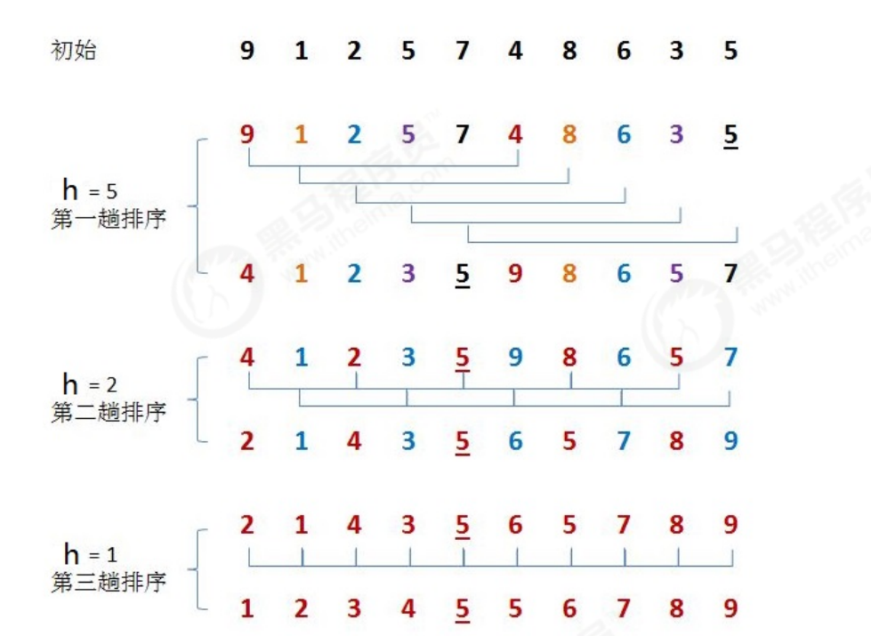
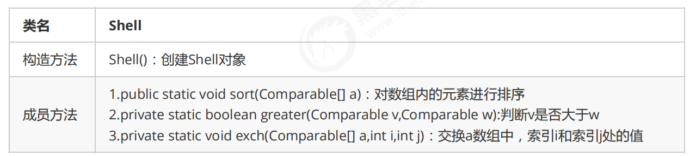

#高级排序
##希尔排序
#####希尔排序是插入排序的一种，又称“缩小增量排序”，是插入排序算法的一种更高效的改进版本。
前面学习插入排序的时候，我们会发现一个很不友好的事儿，如果已排序的分组元素为{2,5,7,9,10}，未排序的分组
元素为{1,8}，那么下一个待插入元素为1，我们需要拿着1从后往前，依次和10,9,7,5,2进行交换位置，才能完成真
正的插入，每次交换只能和相邻的元素交换位置。那如果我们要提高效率，直观的想法就是一次交换，能把1放到
更前面的位置，比如一次交换就能把1插到2和5之间，这样一次交换1就向前走了5个位置，可以减少交换的次数，
这样的需求如何实现呢？接下来我们来看看希尔排序的原理。

####需求：
#####排序前：{9,1,2,5,7,4,8,6,3,5}
#####排序后：{1,2,3,4,5,5,6,7,8,9}
#####排序原理：
 #####1.选定一个增长量h，按照增长量h作为数据分组的依据，对数据进行分组；
 #####2.对分好组的每一组数据完成插入排序；
 #####3.减小增长量，最小减为1，重复第二步操作。
 


增长量h的确定：增长量h的值每一固定的规则，我们这里采用以下规则：

```
int h=1 
while(h<5){
     h=2h+1；//3,7 
}
//循环结束后我们就可以确定h的最大值； 
h的减小规则为： 
h=h/2
```

####希尔排序的API设计：


####希尔排序的时间复杂度分析

在希尔排序中，增长量h并没有固定的规则，有很多论文研究了各种不同的递增序列，但都无法证明某个序列是最
好的，对于希尔排序的时间复杂度分析，已经超出了我们课程设计的范畴，所以在这里就不做分析了。
我们可以使用事后分析法对希尔排序和插入排序做性能比较。
在资料的测试数据文件夹下有一个reverse_shell_insertion.txt文件，里面存放的是从100000到1的逆向数据，我们
可以根据这个批量数据完成测试。测试的思想：在执行排序前前记录一个时间，在排序完成后记录一个时间，两个
时间的时间差就是排序的耗时。