###归并排序
#####归并排序是建立在归并操作上的一种有效的排序算法，该算法是采用分治法的一个非常典型的应用。将已有序的子序列合并，得到完全有序的序列；即先使每个子序列有序，再使子序列段间有序。若将两个有序表合并成一个有序表，称为二路归并。

###需求：
#####排序前：{8,4,5,7,1,3,6,2}
#####排序后：{1,2,3,4,5,6,7,8}

###排序原理：
#####1.尽可能的一组数据拆分成两个元素相等的子组，并对每一个子组继续拆分，直到拆分后的每个子组的元素个数是1为止。
#####2.将相邻的两个子组进行合并成一个有序的大组；
#####3.不断的重复步骤2，直到最终只有一个组为止。
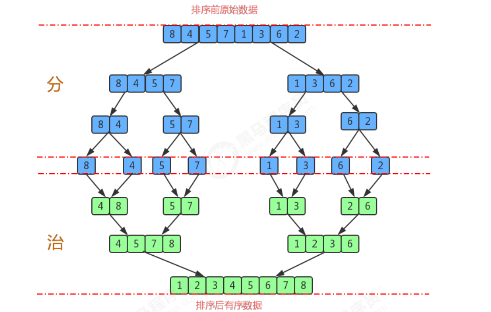

####归并排序API设计：
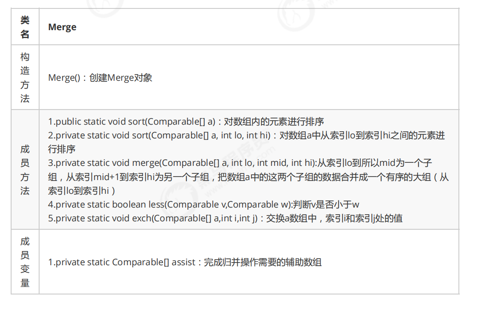

###归并原理：
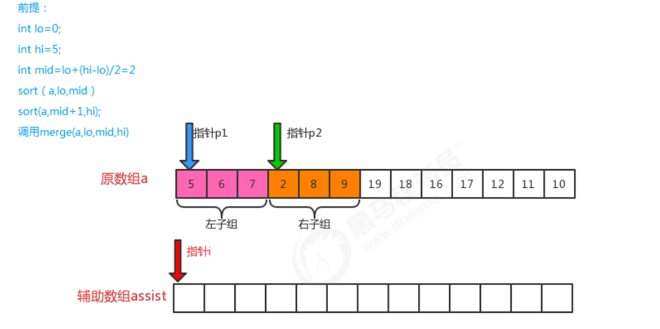
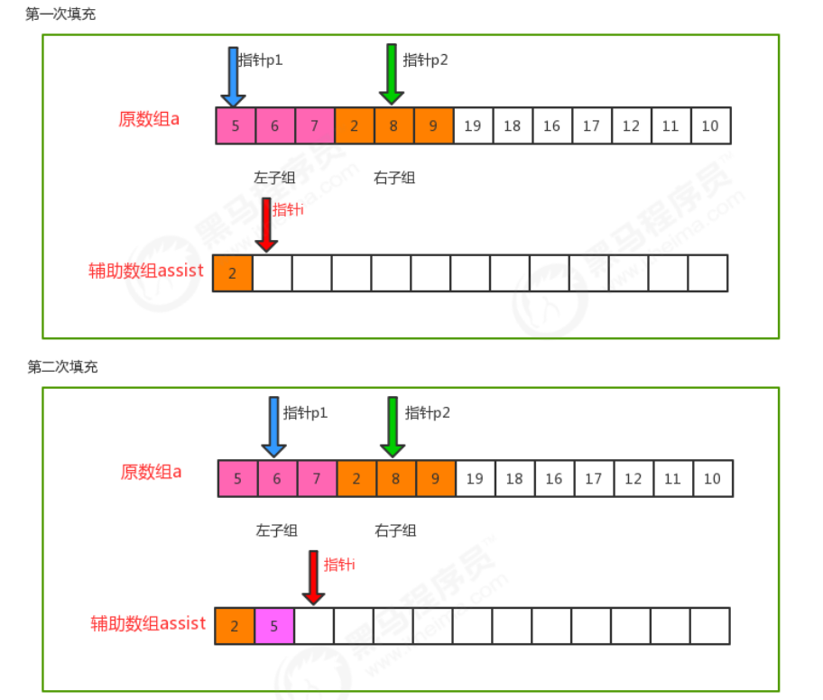
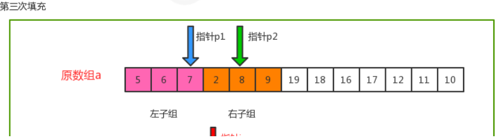
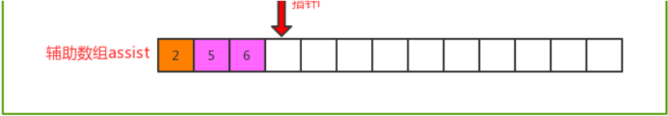
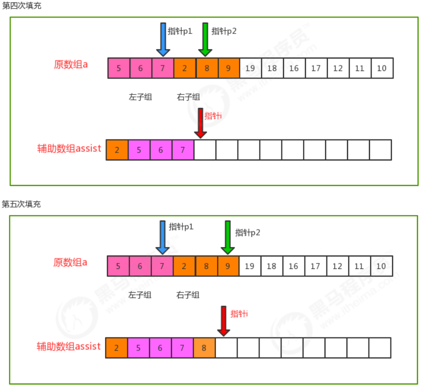
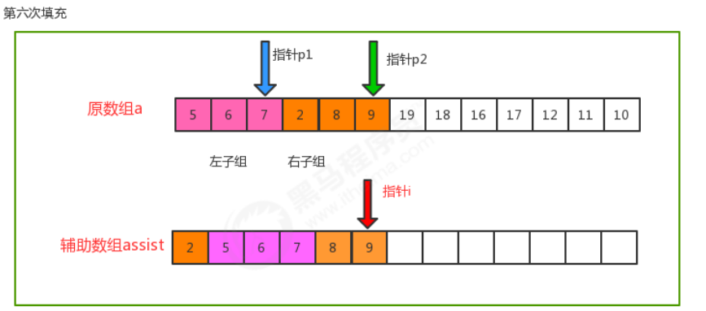
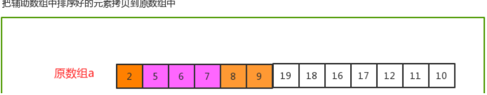
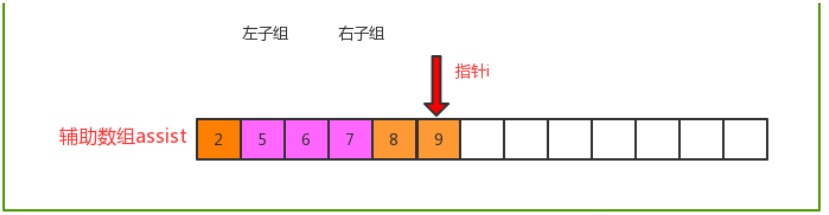

####归并排序时间复杂度分析：
######归并排序是分治思想的最典型的例子，上面的算法中，对a[lo...hi]进行排序，先将它分为a[lo...mid]和a[mid+1...hi]两部分，分别通过递归调用将他们单独排序，最后将有序的子数组归并为最终的排序结果。该递归的出口在于如果一个数组不能再被分为两个子数组，那么就会执行merge进行归并，在归并的时候判断元素的大小进行排序。
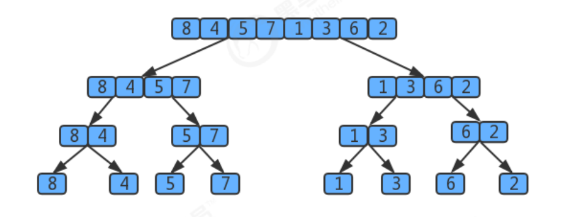
######用树状图来描述归并，如果一个数组有8个元素，那么它将每次除以2找最小的子数组，共拆log8次，值为3，所以树共有3层,那么自顶向下第k层有2^k个子数组，每个数组的长度为2^(3-k)，归并最多需要2^(3-k)次比较。因此每层的比较次数为 2^k * 2^(3-k)=2^3,那么3层总共为 3*2^3。假设元素的个数为n，那么使用归并排序拆分的次数为log2(n),所以共log2(n)层，那么使用log2(n)替换上面3*2^3中 的3这个层数，最终得出的归并排序的时间复杂度为：log2(n)* 2^(log2(n))=log2(n)*n,根据大O推导法则，忽略底数，最终归并排序的时间复杂度为O(nlogn);
####归并排序的缺点：
#####需要申请额外的数组空间，导致空间复杂度提升，是典型的以空间换时间的操作。