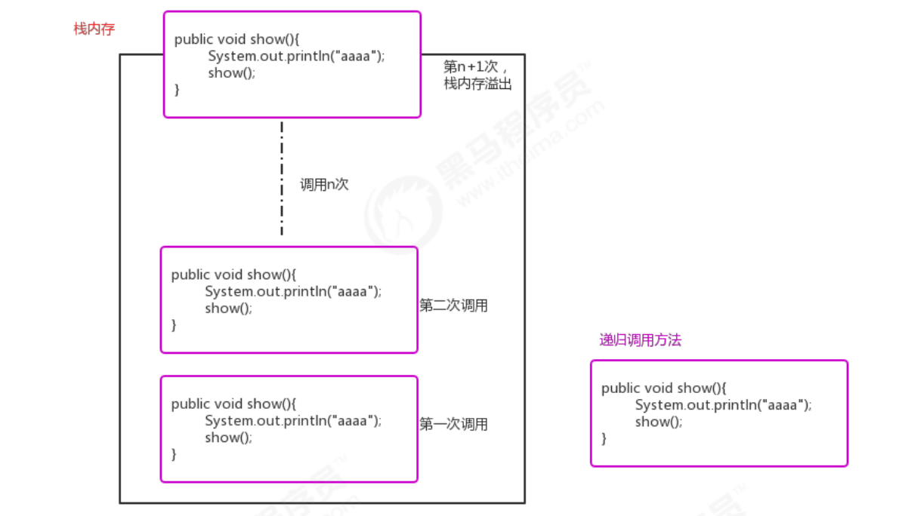

# 递归排序
###定义：
定义方法时，在方法内部调用方法本身，称之为递归.
```
public void show(){
 System.out.println("aaaa"); 
 show(); 
}
```

###作用：
####它通常把一个大型复杂的问题，层层转换为一个与原问题相似的，规模较小的问题来求解。递归策略只需要少量的程序就可以描述出解题过程所需要的多次重复计算，大大地减少了程序的代码量。

###注意事项：
####在递归中，不能无限制的调用自己，必须要有边界条件，能够让递归结束，因为每一次递归调用都会在栈内存开辟新的空间，重新执行方法，如果递归的层级太深，很容易造成栈内存溢出。


###需求：
####请定义一个方法，使用递归完成求N的阶乘；
####分析：
#######1!: 1
#######2!: 2*1=2*1!
#######3!: 3*2*1=3*2!
#######4!: 4*3*2*1=4*3!
#######...
#######n!: n*(n-1)*(n-2)...*2*1=n*(n-1)!
#######所以，假设有一个方法factorial(n)用来求n的阶乘，那么n的阶乘还可以表示为n*factorial(n-1)
```java
public class Test {
 public static void main(String[] args) throws Exception { 
    int result = factorial(5); 
    System.out.println(result); 

 }
public static int factorial(int n){
     if (n==1){
        return 1; 
    }
    return n*factorial(n-1); 
  } 

}
```


