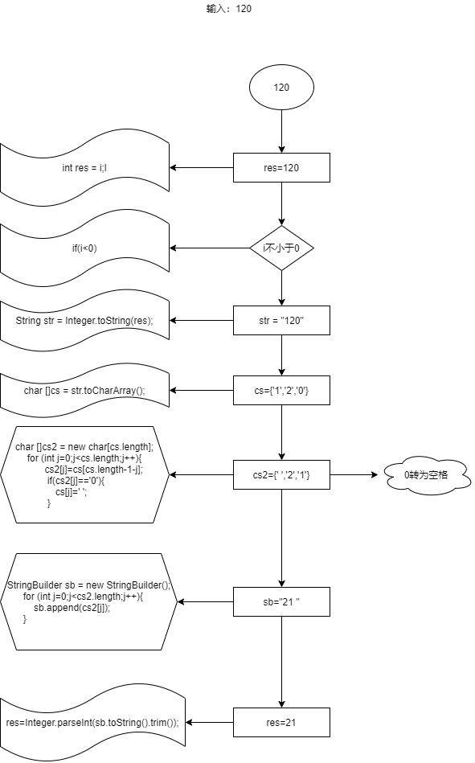
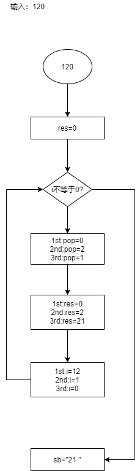

# 整数反转
### 题目：给出一个32位的有符号整数，你需要将这个整数中每位上的数字进行反转。

#### 示例1：

``` java
  输入： 123
  输出： 321
```

#### 示例2：

``` java
  输入： -123
  输出： -321
```

#### 示例3：

``` java
  输入： 120
  输出： 21
```

#### 注意：
假设我们的环境只能存储得下32位的有符号整数，则其数值范围为[-2^31^,2^31^-1]。请根据这个假设，如果反转后整数溢出那么就返回0。

#### 解法1：

##### 暴力破解
我们可以通过字符串反转，然后再通过抛出异常来检查数值范围。

我们就以120为例画一个图看一下




``` java
public int reverse(int i){
        int res = i;
        if (i<0){
            res=0-i;
        }
        String str = Integer.toString(res);
        char []cs = str.toCharArray();
        char []cs2 = new char[cs.length];
        for (int j=0;j<cs.length;j++){
            cs2[j]=cs[cs.length-1-j];
            if (cs2[j]=='0'){
                cs2[j]=' ';
            }
        }
        StringBuilder sb = new StringBuilder();
        for (int j=0;j<cs2.length;j++){
            sb.append(cs2[j]);
        }
        try{
            res=Integer.parseInt(sb.toString().trim());
        }catch (NumberFormatException e){
            return 0;
        }
        if (i<0){
            return -res;
        }
        return res;
    }
```


#### 解法2：

##### 数学运算

我们可以通过已知的数学运算公式，来确立，并进行运算。
已知数学运算公式：  

int类型运算（java）
1. 任何整数%10 等于其个位数的值 例如： 123%10=3
2. 任何整数÷10 等于其除个位数外的其他位数的整数 例如 123/10=12

我们就以120为例画一个图看一下 



```
public int reverse(int i) {
        //返回结果初始值
        int res = 0;
        //过滤掉最后一位数为0或者当前数为0
        while (i != 0) {
            // i%10 = i的个位数
            int pop = i % 10;
            //结果大于 int类型最大值/10 或者 （结果等于int类型最大值/10 并且 i的个位数 大于7 判断是否超出int的最大值
            if (res > Integer.MAX_VALUE / 10 || (res == Integer.MAX_VALUE / 10 && pop > 7)) 
                return 0;
            //结果小于 int类型最小值/10 或者 （结果等于int类型最小值/10 并且 i的个位数 小于-8 判断是否超出int的最小值
            if (res < Integer.MIN_VALUE / 10 || (res == Integer.MIN_VALUE / 10 && pop < -8)) 
                return 0;
            //每次将结果乘以10再加i的个位数
            res = res * 10 + pop;
            //每次去除个位数
            i /= 10;
        }
        return res;
    }
```


