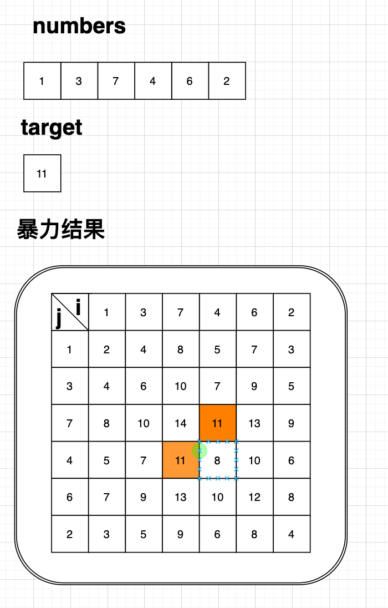
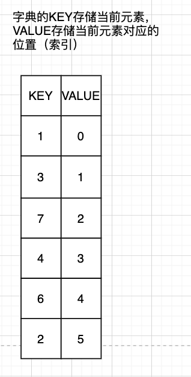

 
# 两数之和

提供一个整数类型的数组numbers和一个目标和值target，请在数组中找到和为目标的两个整数,目前只需要找到一对即可。


示例：

给定numbers = [1,3,7,4,6,2],targe = 11,返回[4,7]


### 解题思路一：暴力破解

#### 暴力破解方法是如何实现呢？
暴力破解的思路一般就是穷举把所有可能出现的情况都拿出来进行比较如果有符合满足的情况则为找到的结果。
暴力破解的优点就是比较好理解，缺点就是需要遍历所有可能出现的情况，会耗费更多的时间和更多的资源。


#### 参考代码（Java）
```
        int[] numbers = new int[]{1, 3, 7, 4, 6, 2};
        int target = 11;
        int[] result = null;
        for (int i = 0; i < numbers.length; i++) {
            for (int j = 0; j < numbers.length; j++) {
                if (numbers[i] + numbers[j] == target) {
                    result = new int[]{numbers[i], numbers[j]};
                }
            }
        }
``` 

#### 暴力破解可能出现的情况如下：



#### 复杂度
空间复杂度为O($n^2$)
时间复杂度为O(1)


### 解题思路二：先建立字典后查找

#### 字典中查找实现的思路是什么呢？

字典在Java中可以用Map类型实现，字典我们每个人应该都有用过可以通过某个属性找到其他属性，在Java中我们一般用哈希表Map
来表示，Map具有什么特征呢：将键映射到值的对象。映射不能包含重复的键；每个键最多可以映射到一个值。
那如何用Map来解决寻找和的问题呢，我们想一下我们目的是找到两个数字的和如果暴力破解就需要通过遍历第一个和数的去找到第二个和数，这里我们可以看到遍历另外一个和数的时候使用的最大时间复杂度就是O($n^2$),我们是不是可以进行优化，提前将数据存储在Map中拉用空间换时间的方式让查找第二个和数的时间降低到O($n^1$)，

那我们来进行优化尝试：
第一步遍历数组numbers将数据存储在字典Map中；
第二步暴力查询numbers来寻找两个和数；

#### 参考代码（Java）
```
 int[] numbers = new int[]{1, 3, 7, 4, 6, 2};
        int target = 11;
        int[] result = null;
        Map<Integer, Integer> map = new HashMap<>();
        for (int i = 0; i < numbers.length; i++) {
            map.put(numbers[i], i);
        }

        for (int i = 0; i < numbers.length; i++) {
            int otherNum = target - numbers[i];
            //满足情况并且求和两个数字不能是同一个
            if (map.containsKey(otherNum) && map.get(otherNum) != i) {
                result = new int[]{numbers[i], numbers[map.get(otherNum)]};
                break;
            }
        }
        
```

#### 字典存储结构如下图：




#### 复杂度

空间复杂度为O($n$)
时间复杂度为O($n$)


### 解题思路二：一边建立字典一边查找

#### 思路
通过观察可以看出来 <b>先建立字典后查找思路</b> 不论当前数据结构如何都需要完整建立整个字典，完整建立哈希表是一种前面和数找后面和数的方式，换个角度我们是不是也可以后面的和数找前面的如果前面没有则将当前数字放入字典继续查找。这样我们是不是就可以一遍查找存在则返回，不存在则放入字典，那这样做的好处是什么呢，我们举个例子假如针对要求的例子，给定numbers = [1,3,7,4,6,2],targe = 4,返回[1,3]，针对前两个数字就可以求得结果的情况，如果先建立字典我们需要将所有数据存入字典，如果我们边查找边建立就可以在第二次查询时候找到结果，对空间和时间都有足够的提升。

#### 参考代码（Java）

```
int[] numbers = new int[]{1, 3, 7, 4, 6, 2};
        int target = 11;
        int[] result = null;
        Map<Integer, Integer> map = new HashMap<>();

        for (int i = 0; i < numbers.length; i++) {
            int otherNum = target - numbers[i];
            if (map.containsKey(otherNum)) {
                result = new int[]{numbers[i], numbers[map.get(otherNum)]};
            } else {
                map.put(numbers[i], i);
            }
        }
```

#### 复杂度

空间复杂度为O($n$)
时间复杂度为O($n$)


### 其他解法
后续更新，敬请关注