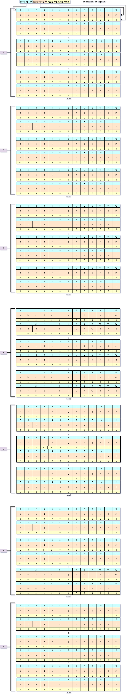

# 有效字母异位词

### 给定两个字符串 s 和 t ，编写一个函数来判断 t 是否是 s 的字母异位词。

#### 示例 1：

``` java
输入： s = "anagram",t = "nagaram"
输出： true
```

#### 示例 2：

``` java
输入： s = "rat" , t = "car"
输出: false
```

#### 说明：

你可以假设字符串只包含小写字母。


#### 解法:
此题可以开辟26个长度的数组来存储26个字母,然后将s字符串出现的字符加上1,将t出现的字符减去1,当字符串循环结束,数组中的值不等于0,则说明两个字符串的字母不是有效异位词.

我们以s = "anagram",t = "nagaram" 为例,画图如下




``` java
public boolean isAnagram(String s,String t){
    if(s.length() != t.length()){
        return false;
    }
    int [] anagram = new int[26];
    for(int i=0; i< s.length(); i++){
        anagram[s.charAt(i) - 'a' ] ++;
        anagram[t.charAt(i) - 'a' ] --;
    }
    for(int i=0;i<26;i++){
        if(anagram[i] != 0){
            return false;
        }
    }
    return true;
}

```

#### 复杂度分析

- 时间复杂度: O(N),其中N标识s指令串的长度.因为我们只需要遍历一遍字符串即可.
- 空间复杂度:O(1).无论N多大,我们都只需要26位的数组空间,来存放有限的26个英文字母.